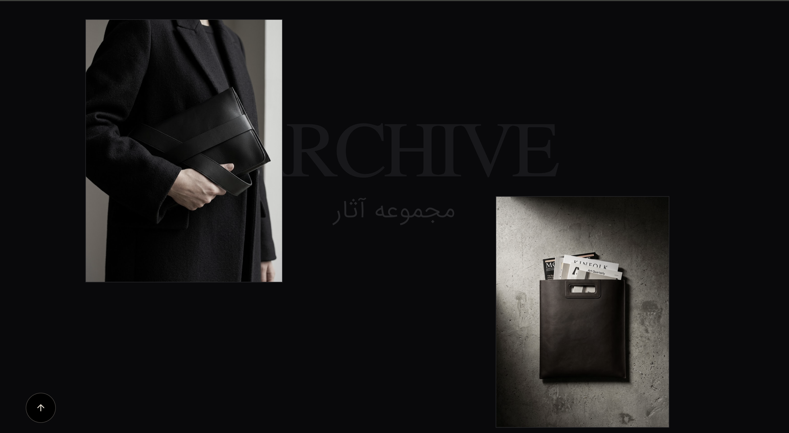

# SELPA | Bespoke Leather Craft

> An interactive, highly minimalist luxury portfolio and hidden archive for a bespoke leather craft atelier.


Selpa is a digital experience designed to reflect the authenticity, texture, and deep storytelling of handcrafted leather goods. Built with a focus on fluid typography, cinematic transitions, and a hidden "discovery reward" system.

## ❖ Visual Experience

The architecture of the user interface relies heavily on negative space, premium typography harmonization, and custom GSAP interactions to create an Awwwards-tier browsing experience.

- **Cinematic Preloader:** A staggered, typographic loading sequence.
- **Fluid Smart Cursor:** Custom `mix-blend-difference` cursor tracking.
- **The Hidden Archive:** A secret scroll-triggered database fetching user "Whispers".
- **Dynamic Hero States:** The hero section logically adapts and transforms after the user discovers the hidden archive.

## ❖ Previews

| The Hidden Archive | Premium Products |
| :---: | :---: |
|  |  |

## ❖ Tech Stack

Engineered for extreme performance and seamless animations:

- **Framework:** Astro
- **UI Library:** React
- **Language:** TypeScript
- **Styling:** Tailwind CSS
- **Animations:** GSAP & ScrollTrigger
- **Database:** Astro DB

## ❖ Local Development

To run this project locally, execute the following commands:

```bash
# Install dependencies
npm install

# Start the development server
npm run dev